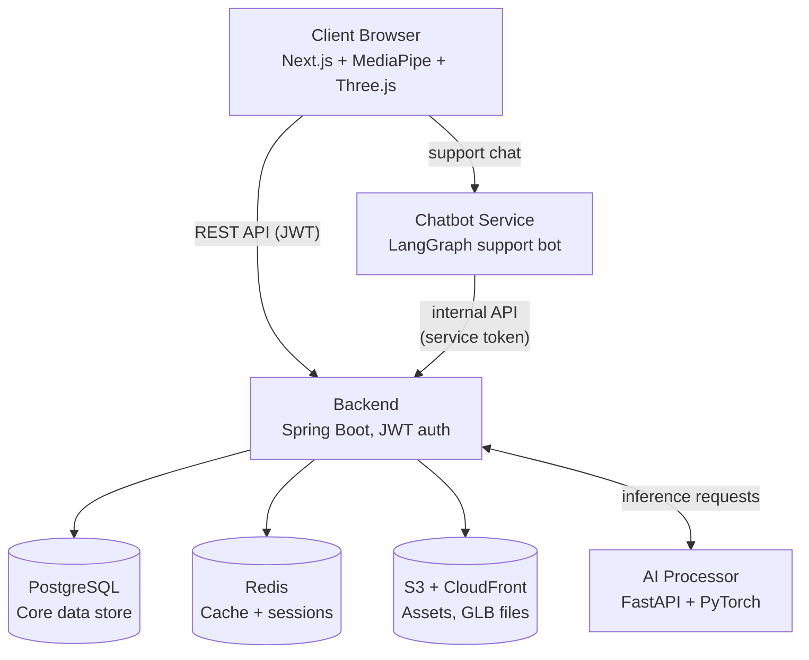

# Architecture — Jewellery VTO Store

This document describes the system architecture: services, data flow, and key design decisions. Keep it updated as the system evolves — this is the reference for onboarding and for decisions like "where should this new feature live?"

## Overview

The system is composed of four independently deployable services plus shared infrastructure.

## Services

### `frontend/` — Client application
- **Stack:** Next.js, React, TypeScript, Tailwind CSS
- **Responsibilities:** product browsing, cart/checkout UI, auth pages, embedding the chatbot widget
- **Runs client-side:** MediaPipe (face/hand/pose landmark tracking) and Three.js (3D rendering of GLB jewellery models onto tracked landmarks) — both execute fully in the browser, no server round-trip for live tracking
- **Talks to:** `backend/` (REST API), `chatbot/` (support chat)

### `backend/` — Core API service
- **Stack:** Spring Boot, Spring Security, JWT
- **Responsibilities:** auth (register/login/refresh), product catalog, cart, orders, user profiles
- **Owns:** PostgreSQL (via JPA), Redis (cache/session), S3 (asset URLs)
- **Talks to:** `ai-processor/` (orchestrates try-on inference requests), exposes `/internal/*` endpoints for `chatbot/`
- **Single source of truth** for all customer/order/product data — no other service reads the database directly

### `ai-processor/` — AI/ML inference service
- **Stack:** Python, FastAPI, PyTorch
- **Responsibilities:** heavier AI/ML processing for virtual try-on (beyond what MediaPipe does client-side) — e.g. realistic rendering, model-based try-on refinement
- **Called by:** `backend/` only, not directly by the frontend — keeps this service stateless and swappable
- **Kept separate from `backend/`** so it stays pure Python/PyTorch, can scale independently (GPU vs CPU instances), and can be redeployed without touching the Java service

### `chatbot/` — Customer support chatbot
- **Stack:** Python, LangGraph
- **Responsibilities:** LLM-based customer support conversations (order status, product questions, returns)
- **Auth model:** authenticates to `backend/` as a service (not as the customer) using a shared service token, scoped to `/internal/*` endpoints only
- **Session scoping:** when a logged-in customer is chatting, their customer ID is passed from the frontend session so the chatbot can only query that customer's own data — not arbitrary customer records

## Data layer

| Store | Used for |
|---|---|
| PostgreSQL | Users, products, categories, cart, orders — the system of record |
| Redis | Session/JWT state, product catalog caching, cart caching |
| S3 + CloudFront | Product images and compressed GLB 3D models, served via CDN for fast global load |

## Key flows

### Auth flow
1. Client registers/logs in via `backend/` → receives access + refresh JWT
2. Access token sent as `Authorization: Bearer` on all subsequent API calls
3. Refresh token used to get a new access token when it expires
4. `backend/` validates JWTs via Spring Security on every protected endpoint

### Try-on flow
1. Client runs MediaPipe locally to get face/hand/pose landmarks — no server call
2. Three.js renders the GLB model onto tracked landmarks directly in-browser for the live AR preview
3. If deeper AI processing is needed (e.g. a refined/rendered still image), client sends landmark data to `backend/`
4. `backend/` forwards the request to `ai-processor/`, gets the result, returns it to the client

### Chatbot support flow
1. Customer opens chat widget on `frontend/`, which calls `chatbot/` directly
2. If the chatbot needs order/account info, it calls `backend/`'s `/internal/*` endpoints using its service token, scoped to the active customer's ID
3. `backend/` remains the only service with direct database access

## Service-to-service authentication

- **User-facing calls** (frontend → backend, frontend → chatbot): standard user JWT
- **Internal calls** (chatbot → backend): separate service token (`SERVICE_CHATBOT_TOKEN`), restricted via Spring Security to `ROLE_SERVICE_CHATBOT` and only `/internal/*` endpoints
- **Internal calls** (backend → ai-processor): a similar shared service token pattern, since this is also service-to-service, not user-facing

## Deployment

- Each service is containerized independently (`Dockerfile` per service)
- Local dev: `docker-compose up` runs all four services + PostgreSQL + Redis together
- Target deployment: AWS, with Docker containers (ECS Fargate or similar), S3 + CloudFront for static/3D assets

## Design decisions and rationale

- **Microservices split by language/responsibility**, not by arbitrary boundaries — `backend/` is pure Java, `ai-processor/` and `chatbot/` are pure Python, `frontend/` is pure TypeScript. This keeps each service's build/CI/dependency management clean and lets each scale independently.
- **MediaPipe runs client-side, not server-side** — avoids uploading raw camera video to the server (privacy/compliance win, especially given biometric data regulations) and gives lower latency for live tracking.
- **Backend is the single source of truth** — `chatbot/` and `ai-processor/` never touch PostgreSQL directly; everything goes through `backend/`'s API. This keeps the database schema and business logic in one place.

## Open questions

- Does `ai-processor/` need async job handling (queue) if inference takes longer than a typical request/response cycle, or does it stay synchronous?
- GPU requirements for `ai-processor/` in production (and whether local dev needs GPU passthrough)
- Whether `chatbot/` needs its own persistence for conversation history, or relies entirely on LangGraph's checkpointing
